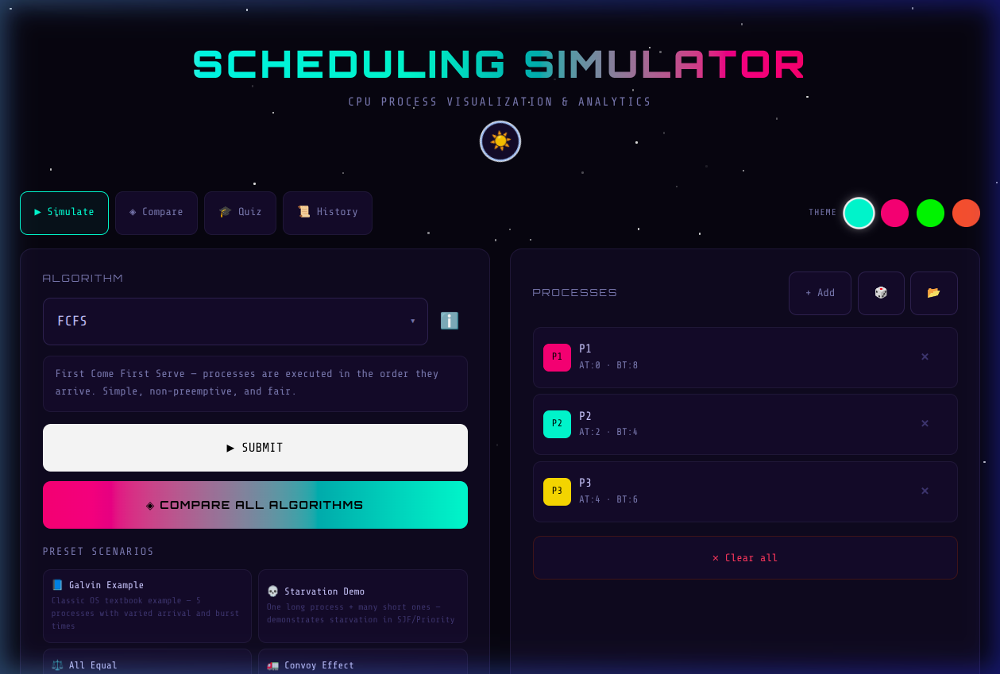
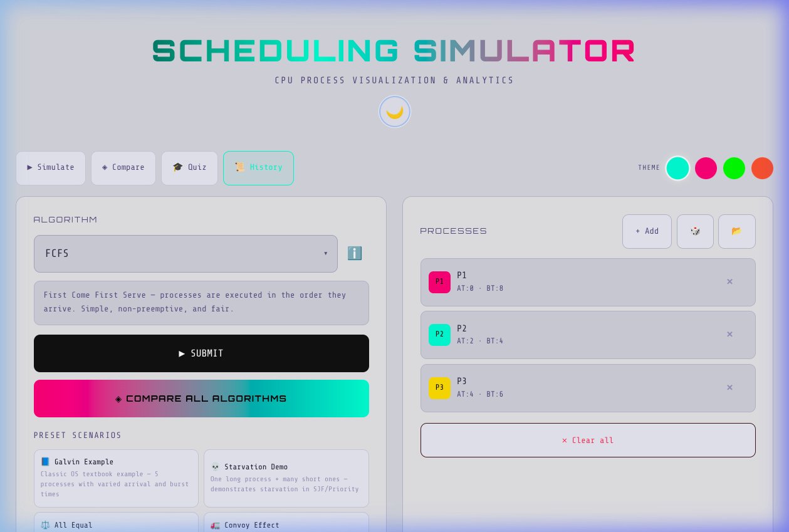
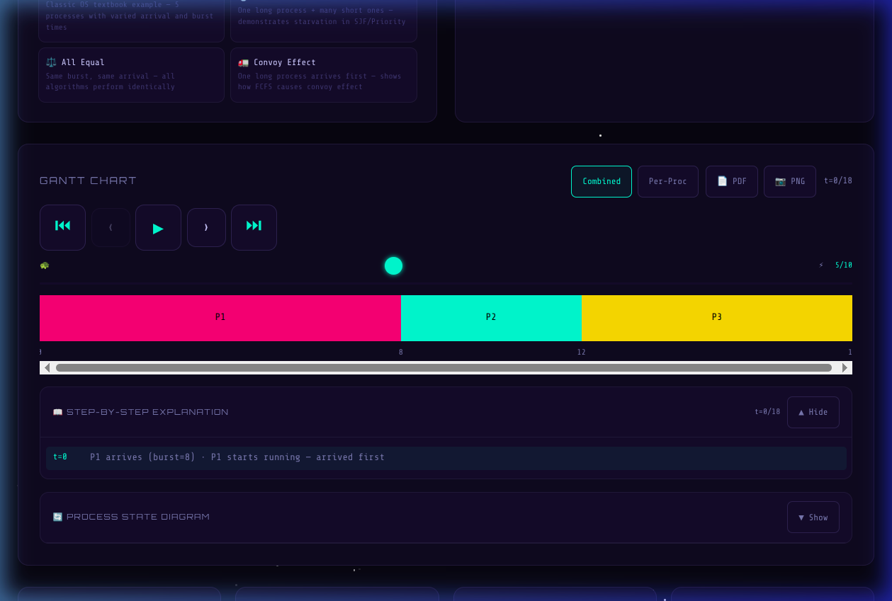
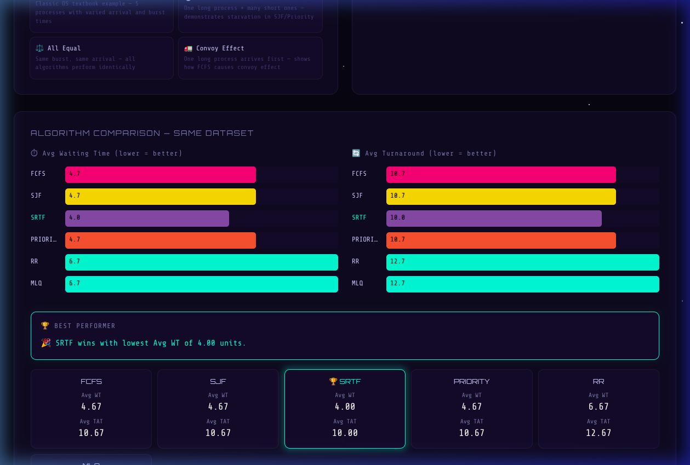
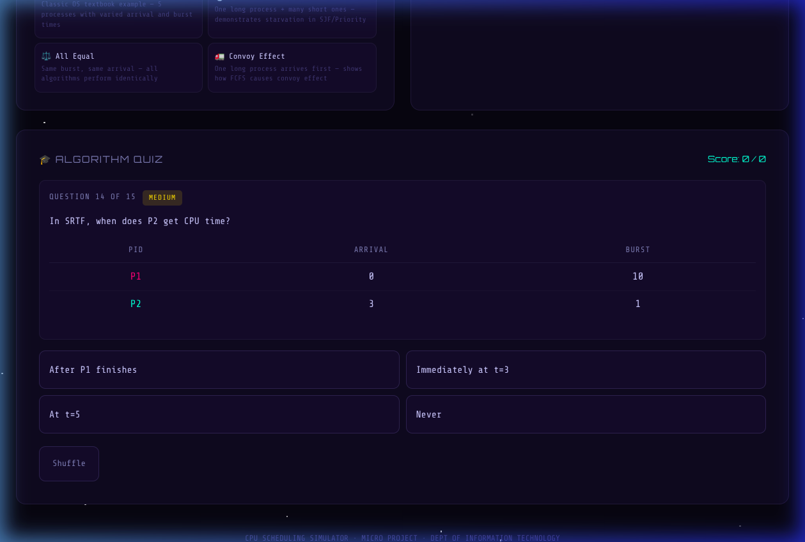
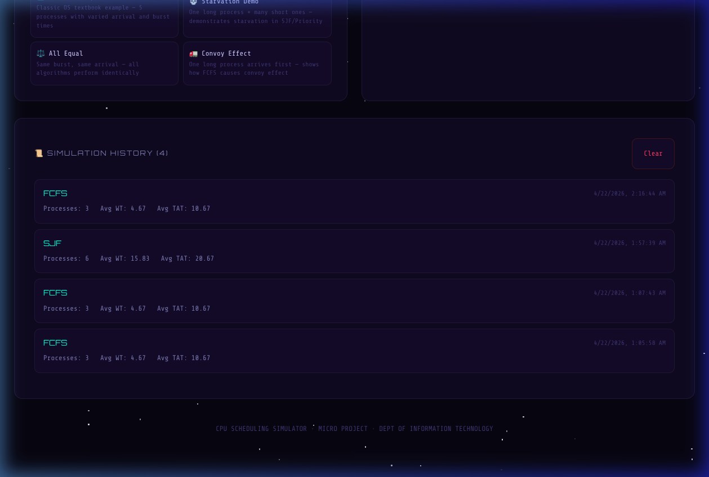

# ⚡ CPU Scheduling Algorithms Simulator

> A comprehensive, interactive, and animated simulator for **seven** CPU scheduling algorithms — featuring I/O burst simulation, starvation detection, algorithm comparison, interactive quizzing, and more. Built with React 19 + Vite 7 using zero external UI libraries.

---

## 🚀 Live Demo

🔗 **[CPU Scheduling Algorithms Simulator](https:cpu-scheduling-algorithms-simulator-gray.vercel.app/)**

---

## 📸 Preview

| Dark Mode | Light Mode |
|-----------|------------|
|  |  |

| Gantt Chart & Playback | Algorithm Comparison |
|------------------------|---------------------|
|  |  |

| Interactive Quiz | Simulation History |
|------------------|-------------------|
|  |  |

---

## ✨ Features

### 🧠 Seven Scheduling Algorithms

| Algorithm | Type | Key Property |
|-----------|------|-------------|
| **FCFS** — First Come First Serve | Non-preemptive | Simplest; executes in arrival order |
| **SJF** — Shortest Job First | Non-preemptive | Minimises average waiting time |
| **SRTF** — Shortest Remaining Time First | Preemptive | Preempts on shorter arrival |
| **Priority Scheduling** | Non-preemptive | Lower number = higher priority |
| **Priority with Aging** | Non-preemptive | Priority improves every 5 wait units — prevents starvation |
| **Round Robin** | Preemptive | Fixed time quantum; prevents starvation |
| **Multilevel Queue (MLQ)** | Mixed | Foreground (RR, q=2, 80% CPU) + Background (FCFS, 20% CPU) |

### 📊 Gantt Chart & Animation Engine
- **Combined view** — all processes on a single scrollable bar
- **Per-Process view** — individual labelled tracks with a live cursor line
- **I/O segment visualization** — striped diagonal patterns for I/O wait periods
- **Play / Pause / Step Forward / Step Back / Reset / Skip to End** playback controls
- **Variable-speed slider** — exponential scaling from ~800 ms/tick to ~100 ms/tick
- **Animated progress bar** tracking simulation completion
- **Step-by-step ExplanationBox** — human-readable scheduling events synced to every tick

### 📈 Results & Analytics
- **Metrics table** — Completion Time, Waiting Time, Turnaround Time, I/O Wait per process
- **Summary stat cards** — Avg WT, Avg TAT, Throughput, CPU Utilisation with animated counters
- **CPU Utilization Timeline** — real-time SVG area chart that updates tick-by-tick
- **Process State Diagram** — animated SVG showing New → Ready → Running → Terminated states
- **Compare All Algorithms** — side-by-side bar charts for avg WT and avg TAT across all 7 algorithms
- **Winner detection** — highlights the best algorithm with a pulsing glow and 🎉 confetti burst
- **Starvation Detector** — warns when processes wait >10 continuous time units

### 🎓 Interactive Quiz
- **15 scenario-based questions** across three difficulty levels (Easy, Medium, Hard)
- Instant feedback with correct/wrong reveal and detailed explanation
- Running score counter and 10-answer streak tracker with colour-coded dots
- Shuffle button for random question selection
- Difficulty badges with colour coding

### 🔧 Data Management & Productivity
- **CSV Import** — load processes from comma-separated files with validation
- **Random Process Generator** — instantly create 4-6 processes with randomized parameters
- **4 Preset Scenarios** — Galvin Example, Starvation Demo, All Equal, Convoy Effect
- **Simulation History** — stores up to 10 past simulations in localStorage with full restore
- **PDF Export** — print-optimized stylesheet via `window.print()`
- **PNG Export** — Gantt chart rendered to Canvas and downloaded as `gantt-chart.png`
- **Algorithm Info Tooltips** — ℹ️ icon showing time/space complexity, preemptiveness, and use cases

### ⚙️ I/O Burst Simulation
- Optional I/O time field for each process
- CPU burst splits into: **CPU Phase 1 → I/O Wait → CPU Phase 2**
- I/O segments rendered with striped patterns in the Gantt chart
- I/O wait time tracked separately in the results table

### 🎨 Polish & UX
- **Dark / Light mode** — toggle with smooth CSS transitions and localStorage persistence
- **4 colour themes** — Cyan 🩵, Pink 🩷, Green 💚, Orange 🧡
- **Animated star background** with randomised twinkle
- **Fully responsive** — 320px handset to 1440px desktop
- **Swipe gestures** to navigate tabs on mobile
- **Toast notifications** for all user actions
- **44px touch targets** for accessibility compliance

---

## 🛠️ Tech Stack

| Layer | Technology |
|-------|-----------|
| Framework | React 19 |
| Build tool | Vite 7 |
| Language | JavaScript (ES Modules) |
| Styling | CSS-in-JS (injected `<style>` tag) + CSS Custom Properties |
| Charts | Pure SVG (no charting libraries) |
| Image Export | Canvas API (no external libraries) |
| Persistence | localStorage (dark mode + simulation history) |
| Fonts | Google Fonts — Orbitron, Share Tech Mono |
| Animation | `setInterval`, `requestAnimationFrame`, CSS Keyframes |
| Linting | ESLint 9 (react-hooks + react-refresh plugins) |
| Deployment | GitHub Actions → GitHub Pages |

> **Zero external UI libraries** — everything is built with React primitives and native browser APIs.

---

## 📂 Project Structure

```
CPU-Scheduling-Algorithms-Simulator/
├── public/
│   └── vite.svg
├── src/
│   ├── App.jsx              # Root component — state management & page layout
│   ├── algorithms.js        # 7 scheduling algorithms + 5 helper functions
│   ├── constants.js         # ALGOS, THEMES, PRESETS, QUIZ_BANK, ALGO_INFO
│   ├── styles.js            # Complete CSS (dark/light mode, print, components)
│   ├── components.jsx       # 14 React components + PNG export utility
│   ├── App.css              # (empty — styles live in styles.js)
│   ├── index.css            # Global resets and body defaults
│   └── main.jsx             # React DOM entry point
├── screenshots/             # Application screenshots for documentation
├── Milestones/              # 5 milestone documents (.docx)
├── Project Report/          # Final project report (.docx)
├── .github/
│   └── workflows/
│       └── deploy.yml       # GitHub Actions CI/CD workflow
├── index.html
├── vite.config.js
├── eslint.config.js
└── package.json
```

### Module Responsibilities

| Module | Lines | Purpose |
|--------|-------|---------|
| `App.jsx` | ~280 | State management, event handlers, page layout |
| `algorithms.js` | ~250 | FCFS, SJF, SRTF, Priority, Priority+Aging, RR, MLQ, I/O engine, starvation detection |
| `constants.js` | ~170 | Algorithm definitions, themes, presets, quiz bank, algorithm info |
| `styles.js` | ~300 | Complete CSS string — dark/light mode, print media, all component styles |
| `components.jsx` | ~450 | 14 React components + `exportGanttPNG` utility |

---

## ⚙️ Getting Started

### Prerequisites
- **Node.js** ≥ 18
- **npm** ≥ 8

### Installation & Development

```bash
# 1. Clone the repository
git clone https://github.com/your-username/CPU-Scheduling-Algorithms-Simulator.git
cd CPU-Scheduling-Algorithms-Simulator

# 2. Install dependencies
npm install

# 3. Start the development server
npm run dev
```

Open [http://localhost:5173](http://localhost:5173) in your browser.

### Production Build

```bash
# Build for production
npm run build

# Preview the production build locally
npm run preview
```

The optimised output is written to the `dist/` directory (~284 KB JS, ~84 KB gzipped).

### Lint

```bash
npm run lint
```

---

## 🚢 Deployment (GitHub Pages)

The repository includes a GitHub Actions workflow that automatically builds and deploys on every push to `main`.

**One-time setup:**

1. Go to **Settings → Pages** in your GitHub repository.
2. Set the **Source** to the `gh-pages` branch.
3. Push any commit to `main` — the workflow handles the rest.

**Workflow file:** `.github/workflows/deploy.yml`

> **Note:** Update the `base` option in `vite.config.js` to match your repository name:
> ```js
> export default defineConfig({ base: '/CPU-Scheduling-Algorithms-Simulator/', plugins: [react()] })
> ```

---

## 📖 How to Use

1. **Select an algorithm** from the dropdown — read the description and click ℹ️ for complexity details.
2. *(Round Robin)* Set the **Time Quantum**. *(Priority)* Toggle **Enable Aging**. *(MLQ)* Assign processes to **Foreground/Background** queues.
3. **Add processes** using any of these methods:
   - **+ Add** — manual entry with Arrival, Burst, Priority, Queue, and I/O Time
   - **🎲 Random** — generate 4-6 random processes instantly
   - **📂 CSV Import** — load from a CSV file (`pid,arrival,burst,priority`)
   - **Preset Scenarios** — Galvin Example, Starvation Demo, All Equal, Convoy Effect
4. Click **▶ SUBMIT** to run the simulation.
5. Use **playback controls** to animate the Gantt chart, or step through tick by tick.
6. Read the **ExplanationBox** for scheduling decisions at every tick.
7. View **CPU Utilization Timeline** and **Process State Diagram** for visual insights.
8. Check **stats cards** and **results table** for performance metrics.
9. ⚠️ **Starvation warnings** appear if any process waits >10 units — they are informational and do not block results.
10. Click **◈ COMPARE ALL ALGORITHMS** to run all 7 algorithms side-by-side.
11. Switch to **🎓 Quiz** tab to test your scheduling knowledge (15 questions, 3 difficulty levels).
12. Check **📜 History** tab to view and restore past simulations.
13. Export results: **📄 PDF** (print) or **📷 PNG** (Gantt chart image download).
14. Toggle **☀️ / 🌙 Dark/Light mode** and pick a **colour theme** from the header.

---

## 🧪 Scheduling Algorithms — Quick Reference

### FCFS — First Come First Serve
Processes execute in arrival order. No preemption. Simple but can produce long waiting times when a large process arrives first (convoy effect).

### SJF — Shortest Job First
The shortest burst-time process in the ready queue runs next. Optimal for minimising average waiting time among non-preemptive algorithms, but requires knowing burst times in advance.

### SRTF — Shortest Remaining Time First
Preemptive version of SJF. The CPU always runs the process with the least remaining burst time. Minimises average waiting time overall but can cause starvation for long processes.

### Priority Scheduling
Each process carries an integer priority; lower number means higher priority. Non-preemptive: once a process starts it runs to completion. Can starve low-priority processes.

### Priority Scheduling with Aging
Enhanced variant that prevents starvation. For every 5 time units a process waits without CPU time, its effective priority improves by 1. Guarantees all processes eventually execute.

### Round Robin
Processes share the CPU in a rotating queue, each receiving a fixed quantum before yielding. Fair and starvation-free. Performance depends heavily on quantum size.

### Multilevel Queue (MLQ)
Divides processes into **Foreground** (Round Robin, quantum=2) and **Background** (FCFS) queues. CPU time is split **80/20** — in every 5-tick cycle, FG gets 4 ticks and BG gets 1. If one queue is empty, the other uses its slot.

---

## 📊 Metrics Explained

| Metric | Formula | Meaning |
|--------|---------|---------|
| **CT** — Completion Time | Last execution end | When the process finishes |
| **TAT** — Turnaround Time | CT − Arrival Time | Total time from arrival to finish |
| **WT** — Waiting Time | TAT − Burst Time | Time spent waiting in the ready queue |
| **RT** — Response Time | First execution − Arrival | Time from arrival to first CPU access |
| **I/O WT** — I/O Wait Time | Duration of I/O phase | Time spent in I/O wait state |
| **Throughput** | Processes ÷ Total Time | Processes completed per unit time |
| **CPU Utilisation** | Busy Time ÷ Total Time × 100 | Percentage of time CPU was not idle |

---

## 🏗️ Feature Summary (15 Features)

| # | Feature | Description |
|---|---------|-------------|
| 1 | Multilevel Queue Scheduling | FG (RR) + BG (FCFS), 80/20 CPU split, queue assignment per process |
| 2 | Priority with Aging | Prevents starvation — priority improves every 5 wait units |
| 3 | CPU Utilization Timeline | Real-time SVG area chart tracking utilization tick-by-tick |
| 4 | Process State Diagram | Animated SVG: New → Ready → Running → Terminated |
| 5 | Starvation Detector | Non-blocking warnings when processes wait >10 continuous units |
| 6 | PDF Export | Print-optimized stylesheet via `window.print()` |
| 7 | PNG Export | Canvas API rendering of Gantt chart → downloadable image |
| 8 | CSV Import | File picker with format validation and error handling |
| 9 | Random Process Generator | Creates 4-6 processes with randomized parameters |
| 10 | Preset Scenarios | Galvin Example, Starvation Demo, All Equal, Convoy Effect |
| 11 | Algorithm Info Tooltips | ℹ️ icon with complexity, preemptiveness, best/worst use cases |
| 12 | Dark / Light Mode | Toggle with smooth transitions + localStorage persistence |
| 13 | Simulation History | 10-entry log in localStorage with full state restore |
| 14 | Expanded Quiz | 15 questions, 3 difficulty levels (Easy/Medium/Hard) |
| 15 | I/O Burst Simulation | CPU₁ → I/O Wait → CPU₂ lifecycle with striped Gantt bars |

---

## 🤝 Team & Acknowledgements

> Developed as a micro-project for the **Department of Information Technology**.

### Milestone Breakdown

| Milestone | Focus | Key Deliverables |
|-----------|-------|-----------------|
| **I** | Algorithmic Foundation | 7 algorithms, I/O engine, starvation detection, helpers |
| **II** | Core UI & Visualization | Gantt chart, playback, process management, stats, explanation |
| **III** | Analytics & Education | Compare engine, quiz (15 Qs), utilization chart, state diagram, tooltips |
| **IV** | Productivity & Data | CSV import, random gen, presets, history, PDF/PNG export, dark/light mode |
| **V** | Polish & Deployment | Responsive audit, ESLint, production build (284 KB), GitHub Actions CI/CD |

---

## 📄 License

This project is released for academic and educational use.

---

<p align="center">
  Made with ❤️ · Dept of Information Technology
</p>
